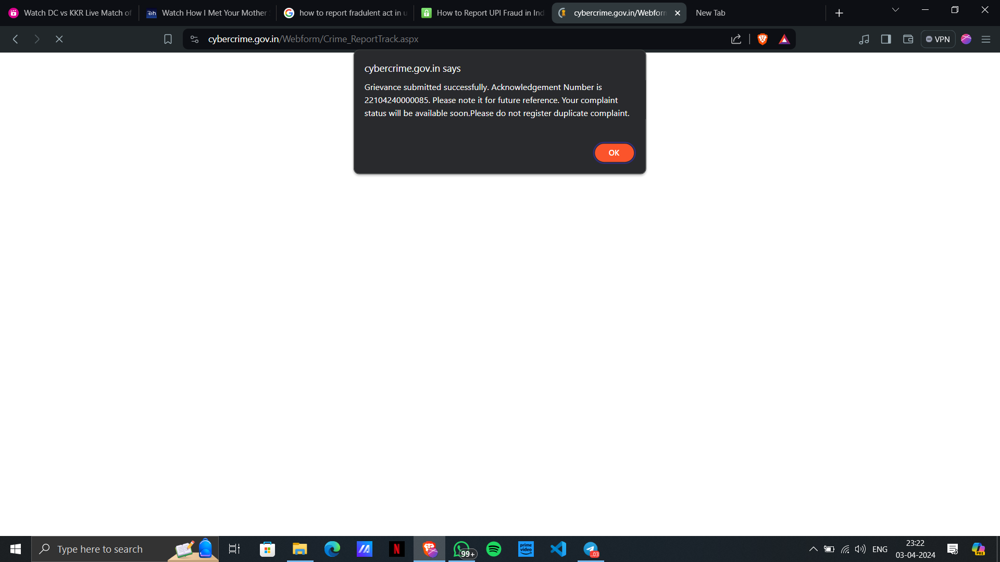

# YouTube Clone



## Description

This project is a clone of YouTube built using React, Tailwind CSS, and TypeScript. It aims to replicate the core features and functionalities of YouTube, such as browsing videos, searching, and playing videos.

## Features

- **Browse Videos:** Users can browse through a collection of videos.
- **Search Videos:** Users can search for videos using keywords.
- **Watch Videos:** Users can watch videos within the application.
- **Responsive Design:** The application is responsive and works seamlessly across different screen sizes.

## Technologies Used

- **React:** Used for building the user interface components and managing the application state.
- **Tailwind CSS:** Utilized for styling the components and creating a modern UI.
- **TypeScript:** Enhances code quality and provides better developer experience with static typing.
- **YouTube API:** Integrated the YouTube API for fetching video data and playback.

## Installation

1. Clone the repository:

   ```bash
   git clone https://github.com/yourusername/youtube-clone.git
